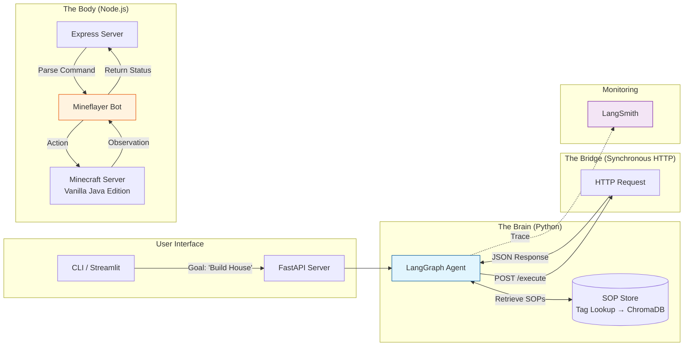
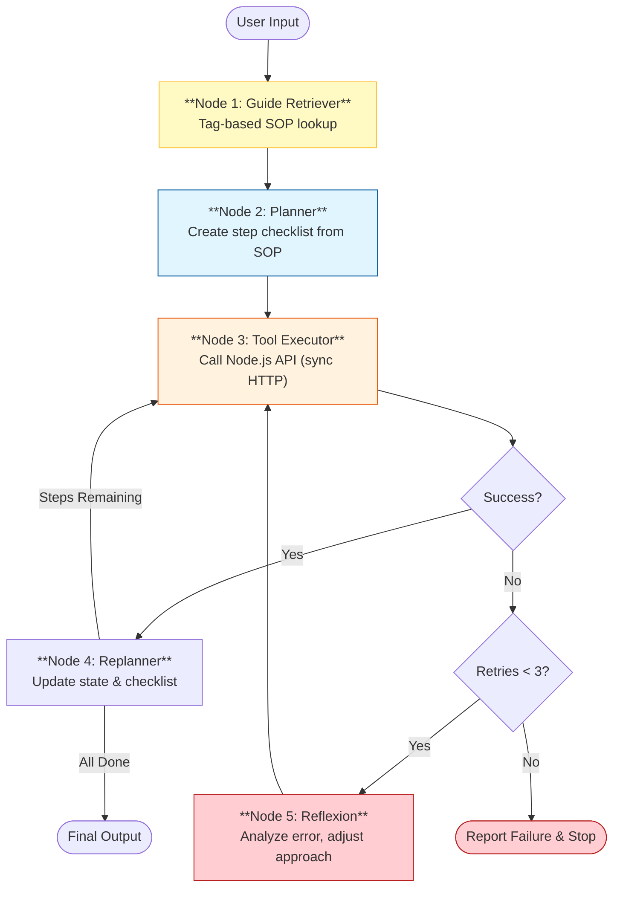

# Project Blueprint: Autonomous Minecraft Builder Agent

**Version**: 1.0
**Status**: Clarified & Ready for Implementation

### Related Documents
- **[DECISION_LOG.md](DECISION_LOG.md)** — Reasoning behind each architectural and technical choice
- **[AGENT_STATE.md](AGENT_STATE.md)** — LangGraph shared state structure with field descriptions

---

## 1. Executive Summary

**Objective**: Build an LLM-powered autonomous agent capable of executing multi-step crafting chains (e.g., "Get me a stone pickaxe") and basic construction tasks (e.g., "Build a 5x5 house") in Minecraft.

**Core Philosophy**: Deterministic Tooling — human-written, robust code handles physics and actions ("The Body"), while the LLM ("The Brain") is strictly responsible for planning, orchestration, and parameter selection. The LLM decides *what* to do; the code handles *how*.

**Project Purpose**: Personal portfolio piece demonstrating AI agent architecture, LLM orchestration, and full-stack integration.

**End Result**: A system where a user types natural language commands via CLI and the agent autonomously plans, gathers resources, and executes tasks without human intervention.

### Capability Scope

| Level | Description | Target |
|-------|-------------|--------|
| **L1** | Single actions (mine, navigate, craft) | Included |
| **L2** | Multi-step dependency chains ("Get me a stone pickaxe") | **Minimum Viable Demo** |
| **L3** | Basic construction ("Build a 5x5 house") | **Stretch Goal** |
| **L4** | Survival loops (reactive, continuous) | Out of scope |

---

## 2. Technology Stack

### The Brain (Reasoning & Control) — Python

| Component | Technology | Purpose |
|-----------|-----------|---------|
| Runtime | Python 3.11+ | Core language |
| Orchestration | LangGraph | Stateful multi-step agent workflow |
| LLM Interface | LangChain | Model-agnostic LLM connection |
| Primary LLM | Gemini 3.0 Flash (`gemini-3-flash-preview`) | $0.50/1M input, $3.00/1M output |
| Alternative LLMs | Claude 4.5 Sonnet, GPT-5 Mini | Post-development cost/performance comparison |
| SOP Retrieval | Tag-based keyword lookup (v1) → ChromaDB (v2) | Standard Operating Procedure retrieval |
| User Interface | CLI (v1) → Streamlit (v2) | User command input and status display |
| Monitoring | LangSmith | Agent workflow tracing and debugging |

**Model-Agnostic Design**: The system uses LangChain's `BaseChatModel` interface, allowing model swaps via configuration without code changes.

### The Body (Execution & Physics) — Node.js

| Component | Technology | Purpose |
|-----------|-----------|---------|
| Runtime | Node.js (LTS) | Execution environment |
| Bot Framework | Mineflayer | Minecraft protocol interaction |
| Navigation | mineflayer-pathfinder | A* pathfinding for movement |
| Interaction | mineflayer-collectblock | Resource gathering automation |
| API Layer | Express.js | HTTP server receiving commands from Python |

### Minecraft Server

| Setting | Value |
|---------|-------|
| Server Type | Vanilla Java Edition |
| World Generation | Normal terrain, fixed seed (reproducible) |
| online-mode | false (local bot auth) |
| Purpose | Single-user development and demo |

---

## 3. High-Level System Architecture

**Design Pattern**: Microservices (Bridge Pattern). Two processes: "Thinking" (Python) and "Doing" (Node.js).

**Communication**: Synchronous HTTP with generous timeouts (~5 minutes). Python sends blocking POST requests to Express; Express responds when the Mineflayer action completes. Upgrade to async polling only if timeout issues arise.

### Diagram: System Overview



### Component Roles

| Component | Role |
|-----------|------|
| **LangGraph Agent** | The decision maker. Breaks goals into steps, selects tools, handles replanning. |
| **SOP Store** | Library of structured task guides. Tag-based lookup in v1, ChromaDB in v2. |
| **Express Server** | The translator. Accepts `{ "tool": "mine", "target": "oak_log", "count": 5 }` and runs the corresponding Mineflayer function. |
| **Mineflayer Bot** | The executor. Handles pathfinding, block interaction, inventory management. |
| **LangSmith** | Workflow monitoring. Full trace of every node execution for debugging. |

---

## 4. Composite Tool Set (v1)

**Design Principle**: Coarse-grained composite tools. Each tool is a complete action — the LLM decides "what", the Node.js code handles "how" (finding, navigating, executing, collecting).

| Tool | Signature | Internal Behavior | Scope |
|------|-----------|-------------------|-------|
| `mine` | `mine(target, count)` | Find nearest block → navigate → dig → collect → repeat until count met | L1/L2 |
| `craft` | `craft(item, count)` | Check recipe → verify materials → place/use crafting table if needed → craft | L2 |
| `place_block` | `place_block(block, x, y, z)` | Navigate to adjacent position → look at target coordinate → place block | L3 |
| `navigate` | `navigate(x, y, z)` | Pathfind and walk to coordinates | L1 |
| `get_bot_status` | `get_bot_status()` | Returns health, hunger, position, inventory contents, nearby blocks/entities | All |
| `chat` | `chat(message)` | Send a chat message in-game | All |

**Notes**:
- `equip` is handled internally by `mine` (equips best tool) and `place_block` (equips the block).
- `find_block` is absorbed into `mine` (finds automatically) and `get_bot_status` (reports surroundings).
- Tools return structured JSON responses with `success`, `data`, and `error` fields.

---

## 5. LangGraph Architecture (The Brain)

**Design Pattern**: Plan-and-Execute with Tag-Based Retrieval and Reflexion.

### Diagram: Agent Workflow



### Node Descriptions

**Node 1: Guide Retriever**
- Input: User goal (e.g., "Get me a stone pickaxe")
- Action: Matches goal against SOP tags using keyword lookup
- Output: The matching SOP (YAML structure with materials and steps)
- Future: Swap to ChromaDB vector search for fuzzy matching

**Node 2: Planner**
- Input: User goal + retrieved SOP
- Action: Generates an ordered list of tool calls from the SOP steps, adapted to current bot status (e.g., skip gathering wood if already in inventory)
- Output: `plan` field in state — list of `{action, params}` dicts

**Node 3: Tool Executor**
- Input: Current step from the plan
- Action: Sends synchronous HTTP POST to the Node.js Express server
- Output: Tool result (success/failure + data)

**Node 4: Replanner**
- Input: Step result + remaining plan
- Action: Updates state, advances `current_step`, checks if all steps complete
- Output: Routes to Execute (more steps) or End (all done)

**Node 5: Reflexion**
- Input: Error from failed tool execution + error history
- Action: LLM analyzes the error and suggests a correction (e.g., "No trees nearby" → add exploration step)
- Output: Modified plan or adjusted parameters for retry
- Constraint: Max 3 retries per step. After 3 failures → report and stop.

### Agent State

The LangGraph shared state is defined in **[AGENT_STATE.md](AGENT_STATE.md)** — includes field descriptions, which nodes read/write each field, and concrete examples. The state tracks: goal, retrieved guide, plan, current step, step results, retry count, bot status, error history, and final result.

---

## 6. SOP Format

**Format**: Semi-structured YAML templates.
**Authoring Workflow**: Draft in natural language first, then convert to YAML.

### Template Structure

```yaml
name: "Stone Pickaxe"
description: "Craft a stone pickaxe from raw materials"
tags: ["crafting", "tools", "pickaxe", "stone"]
requires:
  - item: "oak_log"
    count: 3
  - item: "cobblestone"
    count: 3
steps:
  - action: "mine"
    target: "oak_log"
    count: 3
  - action: "craft"
    item: "oak_planks"
    count: 6
  - action: "craft"
    item: "stick"
    count: 2
  - action: "craft"
    item: "crafting_table"
    count: 1
  - action: "place"
    item: "crafting_table"
  - action: "craft"
    item: "wooden_pickaxe"
    count: 1
  - action: "mine"
    target: "stone"
    count: 3
  - action: "craft"
    item: "stone_pickaxe"
    count: 1
```

### Retrieval (v1 — Tag Lookup)

Each SOP has a `tags` array. The Guide Retriever node matches the user's goal keywords against SOP tags to find the relevant guide. Simple, deterministic, and easy to debug.

### Retrieval (v2 — ChromaDB)

After the core pipeline works end-to-end, the tag-based retriever will be swapped for ChromaDB vector search. This enables fuzzy matching (e.g., "make me a shelter" → matches "house" SOP). The swap is clean because LangChain's `BaseRetriever` interface abstracts the backend.

---

## 7. Error Handling Strategy

### Retry Policy

- **Max retries per step**: 3
- **On exhaustion**: Report failure with error details and stop execution
- **Monitoring**: All executions traced via LangSmith for post-mortem analysis

### Known Failure Scenarios

A living document of failure scenarios will be maintained throughout development. Pre-identified scenarios:

| Error Type | Example | Expected Recovery |
|------------|---------|-------------------|
| Resource not found | "No oak_log within search radius" | Expand search radius, explore further |
| Pathfinding failure | "Can't reach target (blocked by water/cliff)" | Try alternative target of same type |
| Inventory full | "Can't pick up items" | Drop low-value items or report to user |
| Missing materials | "Can't craft — insufficient oak_planks" | Go back and gather missing items |
| Action timeout | Tool call exceeded timeout | Retry with same parameters |
| Unrecoverable | Bot died, server disconnected | Report failure, stop execution |

*New failure scenarios will be documented as they are discovered during development.*

---

## 8. Development Roadmap

| Phase | Name | Deliverable | Done When |
|-------|------|-------------|-----------|
| 1 | **Skeleton** | Python ↔ Node.js HTTP connection | Python can call `/status` and get bot health/position back |
| 2 | **Core Tools** | All 6 composite tools in Node.js | Each tool works when called manually via cURL |
| 3 | **Brain v1** | LangGraph with Planner + Executor nodes | Agent executes single-step command: "Go to 100,64,100 and chat hello" |
| 4 | **Knowledge** | SOP tag lookup + Guide Retriever node | Agent executes multi-step chain: "Get me a stone pickaxe" |
| 5 | **Resilience** | Reflexion node + retry logic + error docs | Agent recovers from common failures (no trees nearby, path blocked) |
| 6 | **Construction** *(stretch)* | `place_block` integration + building from SOP | Agent builds a simple structure from an SOP |
| 7 | **Polish** *(stretch)* | Streamlit UI, ChromaDB, documentation | Portfolio-ready presentation layer |

---

## 9. Future Enhancements (Post-MVP)

These are explicitly out of scope for initial development but noted for potential future work:

- **ChromaDB vector search** for SOP retrieval (fuzzy matching)
- **Streamlit web UI** for visual command input and progress monitoring
- **Alternative LLM comparison** (Claude 4.5 Sonnet, GPT-5 Mini) for cost/performance benchmarking
- **L4 survival loops** (reactive continuous behavior)
- **Multi-agent coordination** (multiple bots working together)
